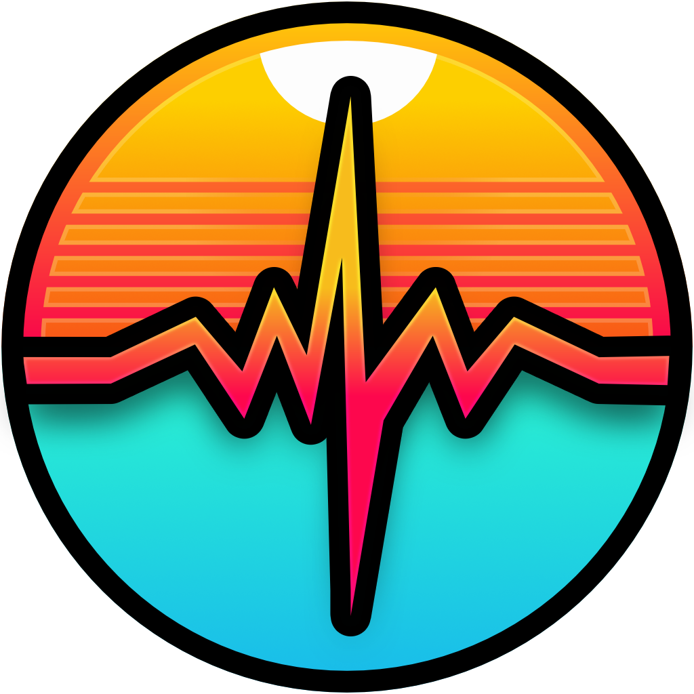

# RetroPulse

## About

RetroPulse is an unobtrusive, cross-platform mod/tracker music player built on [Tauri](https://tauri.app/) and [libopenmpt](https://lib.openmpt.org/). The player primarily resides in the menu bar/tray, designed to be completely out of your way. It was envisioned as a background music player for *soothing* retro music, allowing you to stay productive while enjoying your favorite tunes.

## Disclaimer

Please note that RetroPulse is currently **UNDER DEVELOPMENT** and has not yet reached an alpha state.

## Development

To follow the development of RetroPulse more closely, check out my YouTube video series where I live code various aspects of the application.

[YouTube: MrJakob | RetroPulse Playlist](https://youtube.com/playlist?list=PLy68GuC77sUT3vFkoz0jsIRVC07liRNqr&si=hbKs7fvR9IEKTXFP)
